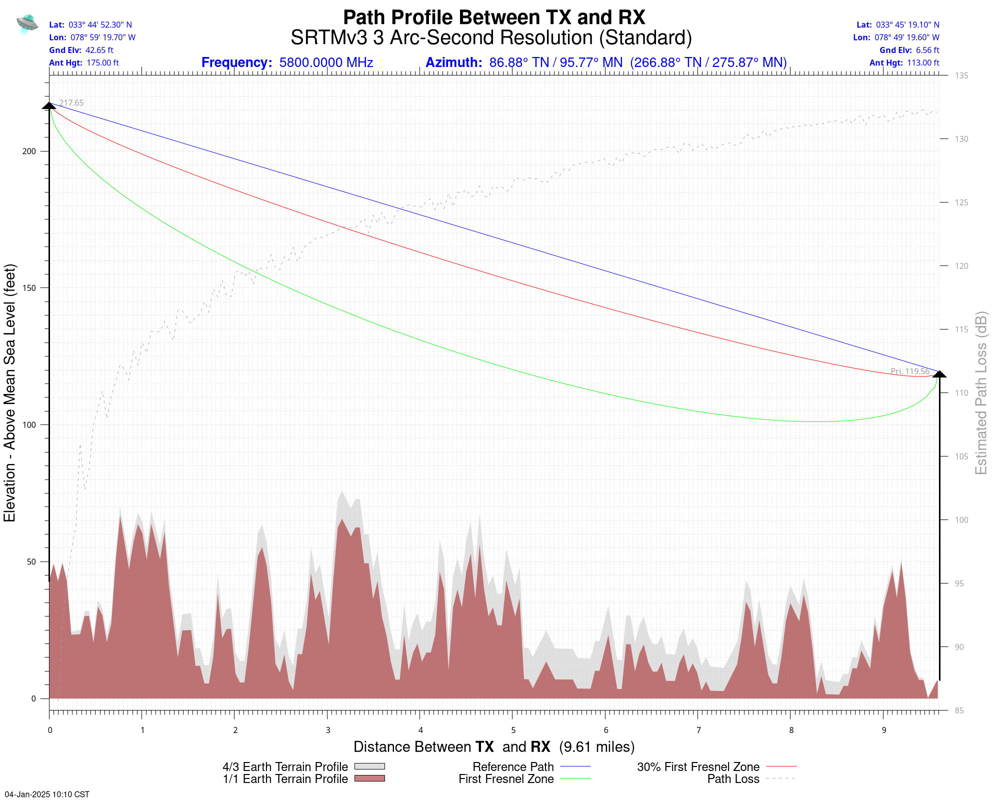
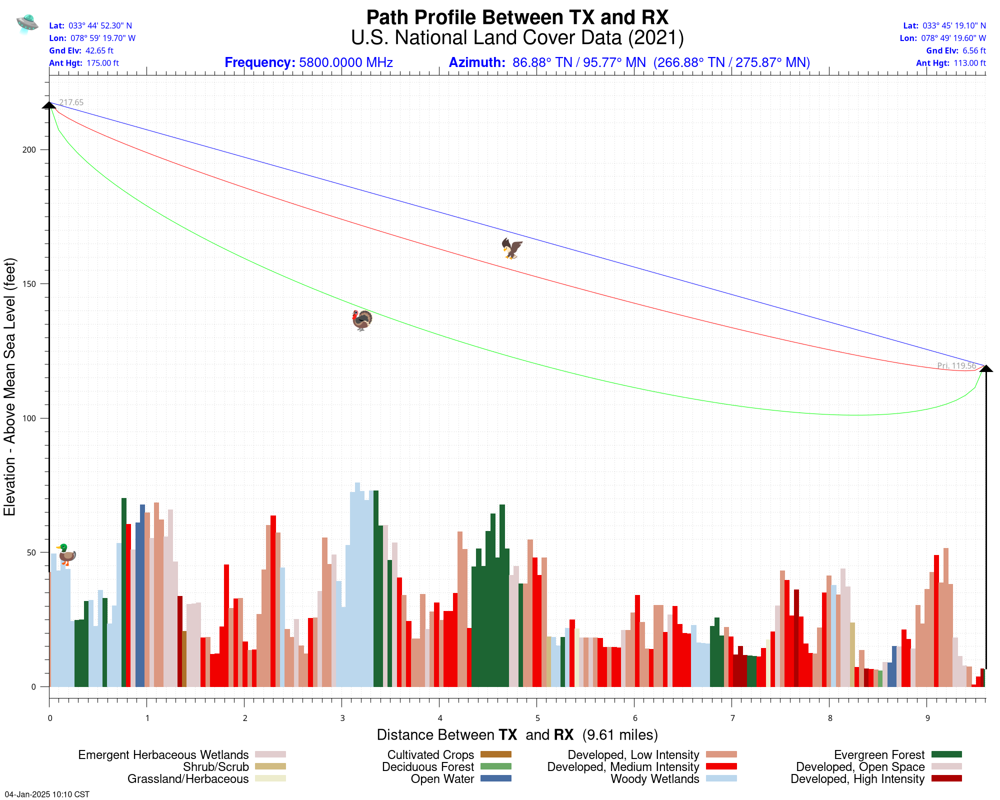

See notes related to SPLAT!: http://www.gbppr.net/splat/

See notes related to the Microwave Path Analysis CGI: http://www.gbppr.net/splat/path.html

Requires a slightly modified version of SPLAT! v2.0-alpha.

Requires the installation of pygeomag (Python) if you wish to calculate magnetic delcination: https://github.com/boxpet/pygeomag

(Install: pip install pygeomag)

Requires the installation of Geo::Coordinates::UTM (Perl) if you wish to calcuate the UTM coordinates.

(Install: sudo cpan Geo::Coordinates::UTM)

Requires the installation of Geo::Coder::OSM (Perl) if you wish to calculate the city/state/country from latitude and longitude.

(Install: sudo cpan Geo::Coder::OSM)

Requires U.S. National Land Cover Data (NLCD 2021): https://us-fcc.app.box.com/v/tvstudy-nlcd2021

Requires the 'ptelev' utility from the FCC's TVStudy program if you wish to calculate path land cover (U.S. only): https://www.fcc.gov/oet/tvstudy

The ptelev source file (clutil.c) needs a slight tweak to work with 2021 NLCD data.

'pdf.tgz' contains PDF datasheets for the various types of coax/wavegude transmission lines.

** Try it out! http://gbppr.ddns.net/path.main.cgi **

