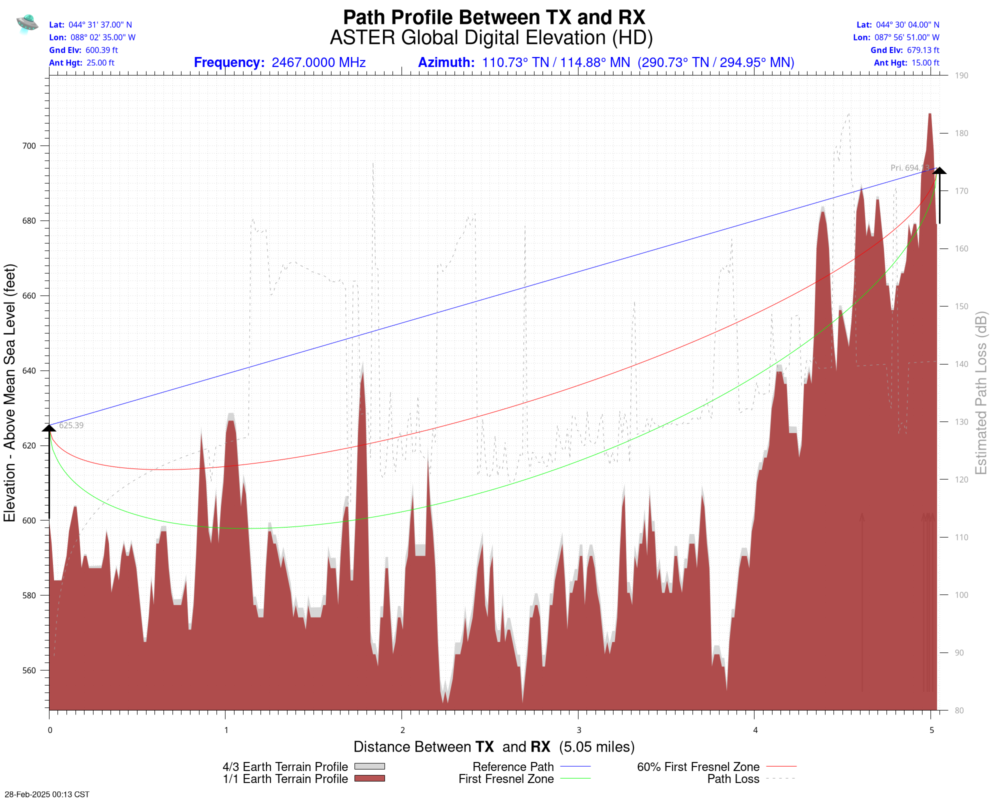
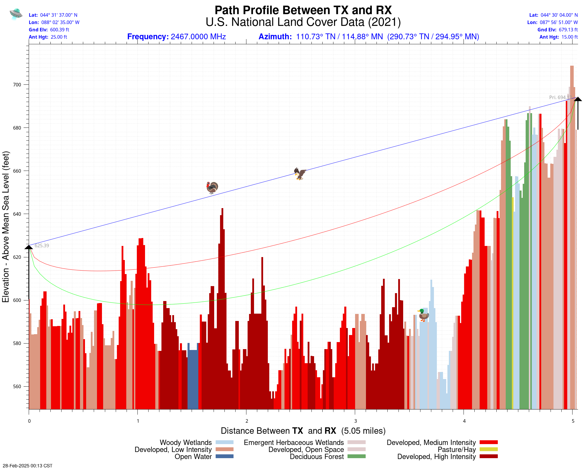

See notes related to SPLAT!: http://www.gbppr.net/splat/

See notes related to the Microwave Radio Path Analysis CGI: http://www.gbppr.net/splat/path.html

Requires a slightly modified version of SPLAT! v2.0-alpha: https://github.com/hoche/splat

Download 'splat-new.tgz', then:
     
     ##### You may have to install these packages, if you haven't already
     $ sudo apt-get install cmake libbz2-dev zlib1g-dev libjpeg-dev libpng-dev libgdal-dev gnuplot htmldoc
     #####
     $ tar xvzf splat-new.tgz
     $ cd splat-new/splat/build
     $ cmake ..
     $ make
     # It should compile with only a few warnings...
     $ sudo mv src/splat /usr/local/bin/
     
Requires your web server to have CGI enabled. For Apache:
     
     $ sudo a2enmod cgi
     Enabling module cgi.
     To activate the new configuration, you need to run:
      (sudo) systemctl restart apache2

Requires a writable 'tmp' directory within your 'cgi-bin' directory and the ability for your HTTP server to send/display files from that 'cgi-bin/tmp' directory:
     
     $ mkdir /www/cgi-bin/tmp
     $ chmod 777 /www/cgi-bin/tmp

In '/etc/apache2/apache2.conf' you may need to add/edit a section that looks like this:

     <Directory "/var/www/html/cgi-bin/">
     <FilesMatch "^(?!.*\.(cgi)$).*$">
     SetHandler default-handler
     </FilesMatch>
     AddHandler cgi-script .cgi
     Options ExecCGI FollowSymLinks
     AllowOverride None
     </Directory>

Install 'path.main.cgi' and 'path.cgi' in '/www/cgi-bin' and 'chmod 755' them.

Install 'path.png', 'nlcd.png', 'Annual_Average_Temperature_Map.png' in '/www/pics'.

Untar and install the coax/waveguide datasheets from 'pdf.tgz' in '/www/pdf'.

Requires the installation of Geo::Coordinates::UTM (Perl) if you wish to calcuate the UTM coordinates.

     $ sudo cpan Geo::Coordinates::UTM

Requires the installation of Geo::Coder::OSM (Perl) if you wish to calculate the city/state/country from latitude and longitude.

     $ sudo cpan Geo::Coder::OSM

Requires the installation of GIS::Distance (Perl) if you wish to use Vincenty great-circle distance calculations: https://en.wikipedia.org/wiki/Vincenty's_formulae

     $ sudo cpan GIS::Distance

Requires U.S. National Land Cover Data (NLCD 2021): https://us-fcc.app.box.com/v/tvstudy-nlcd2021

Requires the 'ptelev' utility from the FCC's TVStudy program if you wish to calculate path land cover (U.S. only): https://www.fcc.gov/oet/tvstudy

The ptelev source file (clutil.c) needs a slight tweak to work with 2021 NLCD data.

I put together a large (30+ GB) single file which contains the converted SPLAT! SDF terrain data files (SRTMv3 3-arc second, worldwide), 2021 NLCD data, and the fixed 'ptelev' program.

It is available here as 'splat.tgz': https://archive.org/details/microwave-path-data

Download 'splat.tgz' and move it to '/usr', then 'tar xvzf splat.tgz' to create the new '/usr/splat' directory which will contain all the necessary data files.

I also put together a large (214+ GB) single file which contains the converted SPLAT! SDF terrain data files using ASTER DEM v3 terrain data. This data is much higher resolution and includes the latitudes missing in the SRTM terrain data.  It does require running SPLAT! in HD mode and the plotting is quite slow.

***Try it out!*** http://gbppr.ddns.net/path.main.cgi

